# 🚀 Multi User Project Management REST API  

A fully-featured **REST API** for managing projects, members, and tasks with secure authentication, role-based authorization, and clean architecture. This project demonstrates real-world backend development practices using **Node.js, Express, MongoDB, JWT, and Zod validation**.  

---  

## 📌 Overview  

This API allows users to collaborate on projects efficiently by:  

- Creating and managing projects  
- Adding/removing team members  
- Creating and managing tasks within projects  
- Enforcing strict access control based on user roles  

The system follows a **modular and scalable architecture**, making it easy to maintain and extend.  

---

## ✨ Features  

### 🔐 Authentication & Security  

- User registration and login system  
- JWT-based authentication  
- Password hashing using bcrypt  
- Protected routes using authentication middleware  
- Token-based request authorization  

---  

### 👤 Role-Based Access Control (RBAC)  

The system defines three roles with specific permissions:  

#### 🟢 Admin  
- Can delete users from the system  

#### 🔵 Project Owner  
- Create projects  
- Delete projects  
- Add and remove members  
- Manage all tasks within the project  

#### 🟡 Project Member  
- View projects they are part of  
- Create tasks  
- Update or delete only their own tasks  

---

### 📁 Project Management

- Create new projects  
- Retrieve all projects (owned + member)  
- View individual project details  
- Delete project (owner only)  

---  

### 👥 Member Management  

- Add users to a project  
- Remove users from a project  
- Prevent duplicate member entries  
- Prevent project owner from being added as a member  

---  

### ✅ Task Management  

- Create tasks within a project  
- Retrieve all tasks for a project  
- Retrieve a single task by ID  
- Update task details  
- Delete tasks  
- Enforce ownership rules for updates/deletion  

---

### 🧾 Data Validation  

- Request validation using **Zod**  
- Ensures:  
  - Correct data types  
  - Valid MongoDB ObjectIds  
  - Required fields  
- Prevents invalid or malformed requests  

---  

### ⚠️ Error Handling  

- Centralized error handling middleware  
- Consistent error response format  
- Handles:  
  - Validation errors  
  - Authentication errors  
  - Authorization errors  
  - Server errors  

---  

## 🏗️ System Architecture  

The API follows a layered architecture:  
> Client → Middleware → Routes → Controllers → Models → Database  

- Middleware handles authentication & validation  
- Controllers manage business logic  
- Models interact with MongoDB  
- Clear separation of concerns  

---  

## 🛠️ Tech Stack  

- **Backend:** Node.js, Express.js  
- **Database:** MongoDB (Mongoose)  
- **Authentication:** JWT (jsonwebtoken)  
- **Validation:** Zod  
- **Security:** bcrypt  
- **Testing:** Postman  

---  

## 📂 Project Structure  
project-root/ 
│
├── controllers/        # Business logic  
├── models/             # Database schemas  
├── routes/             # Application routes  
├── middleware/         # Auth & error middleware  
├── schemas/            # Zod schemas  
├── utils/              # Utilities (AppError etc.)  
├── config/             # Database connection  
├── screenshots/  
│
├── app.js  
├── server.js  
├── .env  
├── package.json  
└── README.md  

---  

## 📡 API Endpoints  

### 🔑 Auth Routes  

| Method | Endpoint         | Description   |
|--------|------------------|---------------|
| POST | /api/auth/register | Register user |
| POST | /api/auth/login    | Login user    |

---  

### 📁 Project Routes  

| Method | Endpoint                                   | Description              |
|--------|--------------------------------------------|--------------------------|
| POST   | /api/projects                              | Create project           |
| GET    | /api/projects                              | Get all projects         |
| GET    | /api/projects/:projectId                   | Get project by ID        |
| PATCH  | /api/projects/:projectId/members           | Add member               |
| DELETE | /api/projects/:projectId/members/:memberId | Remove member            |
| DELETE | /api/projects/:projectId                   | Delete project           |

---

### ✅ Task Routes

| Method | Endpoint                               | Description    |
|--------|----------------------------------------|----------------|
| POST   | /api/projects/:projectId/tasks         | Create task    |
| GET    | /api/projects/:projectId/tasks         | Get all tasks  |
| GET    | /api/projects/:projectId/tasks/:taskId | Get task by ID |
| PATCH  | /api/projects/:projectId/tasks/:taskId | Update task    |
| DELETE | /api/projects/:projectId/tasks/:taskId | Delete task    |

---

### 👤 User Routes (Admin Only)

| Method | Endpoint              | Description |
|--------|-----------------------|-------------|
| DELETE | /api/users/:userId    | Delete user |

---  

## 📸 API Demonstration (Postman)  

### 1️⃣ Register User  
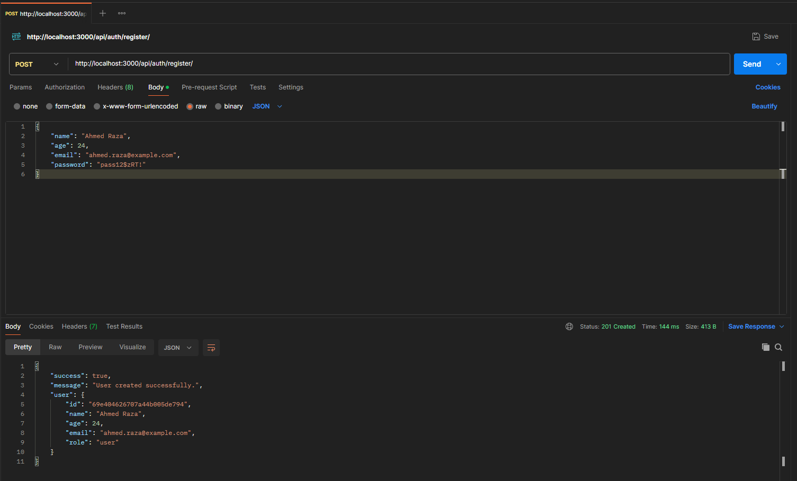  

### 2️⃣ Register Admin  
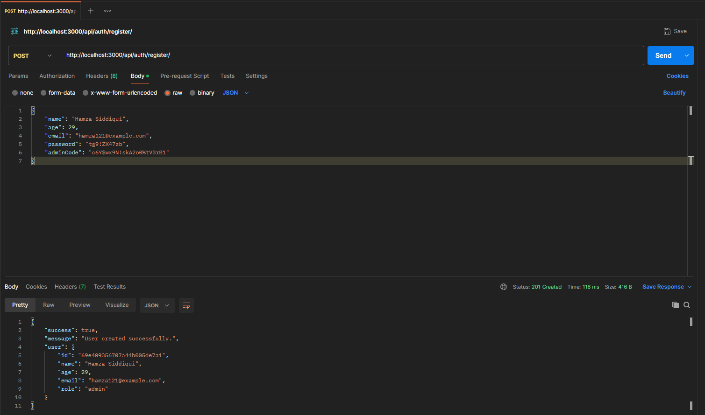  

### 3️⃣ Database (Users Collection)  
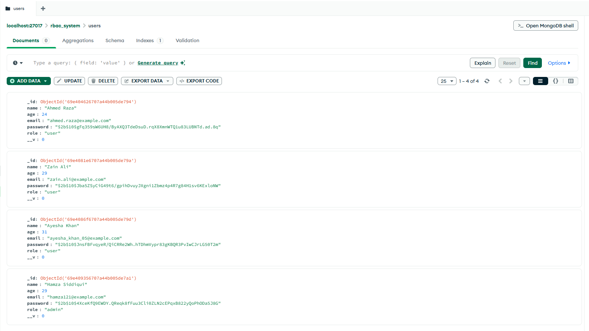  

### 4️⃣ Login User (JWT)  
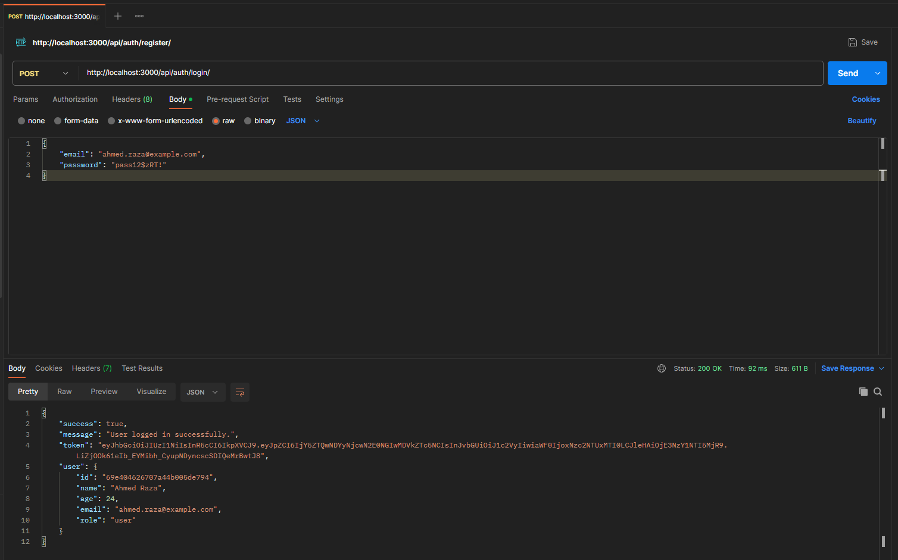  

### 5️⃣ Create Project  
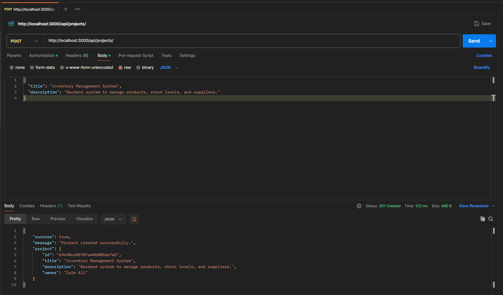  

### 6️⃣ Add Member  
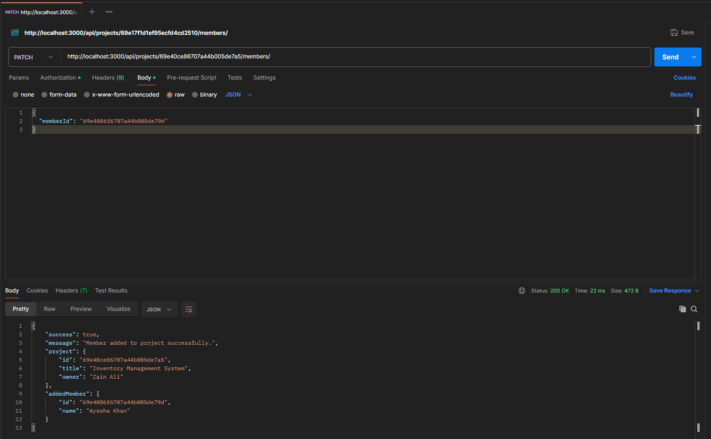  

### 7️⃣ Create Task  
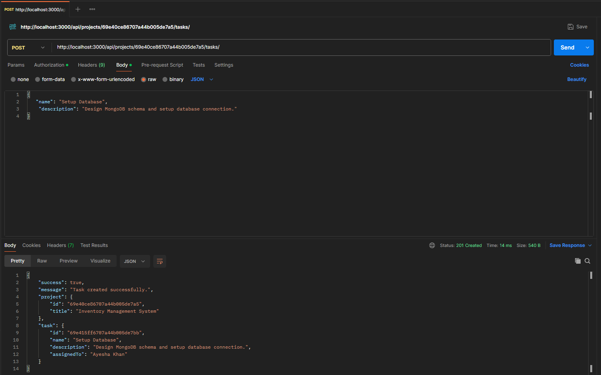  

### 8️⃣ Update Task  
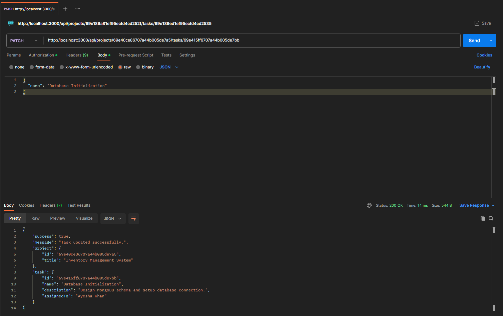  

### 9️⃣ Get Tasks  
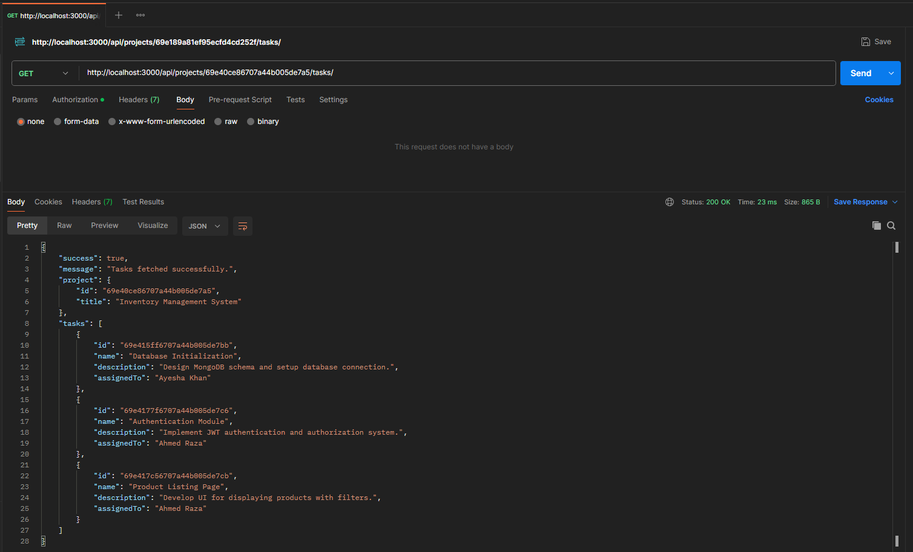  

### 🔟 Get Task by ID  
  

### 1️⃣1️⃣ Delete Task  
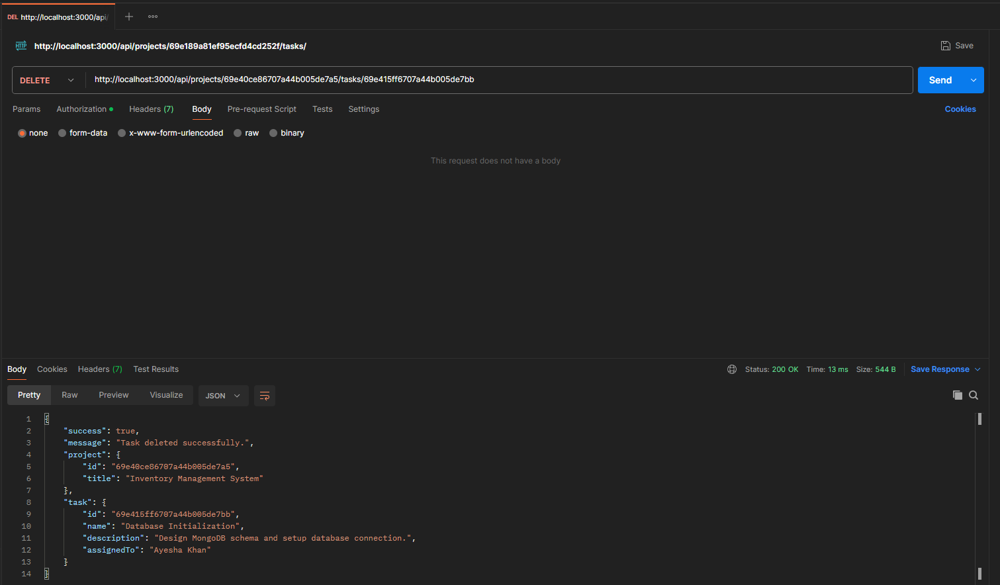  

### 1️⃣2️⃣ Delete Project  
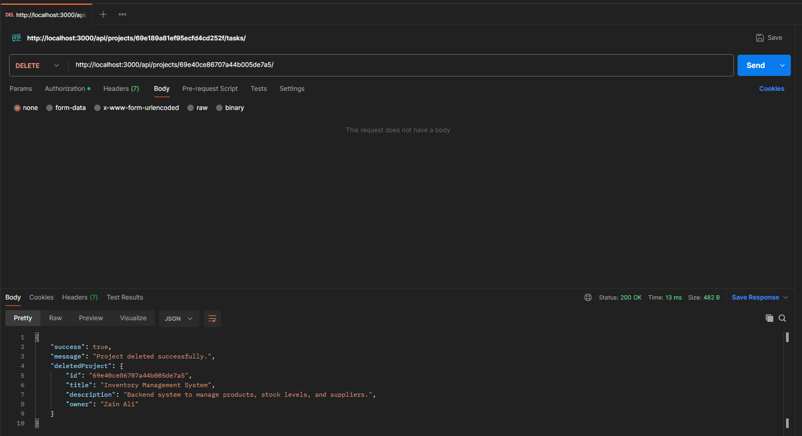  

### 1️⃣3️⃣ Admin Delete User  
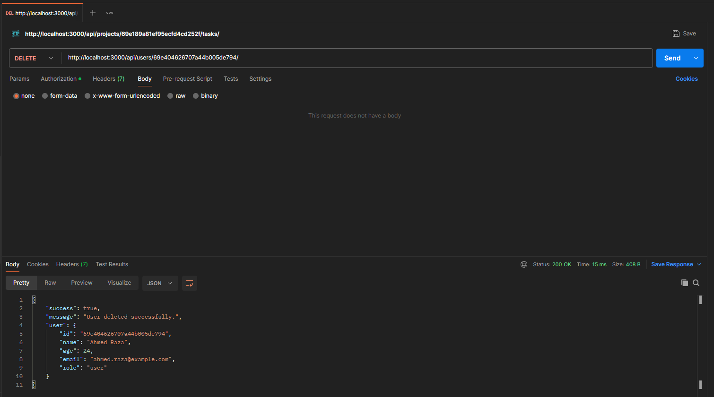  

---

## ▶️ Getting Started  

### 1. Clone the repository  
git clone https://github.com/MdAbbas762/multi-user-project-management-api.git  

cd project-management-rest-api  

---  

### 2. Install dependencies  
npm install  

---  

### 3. Run the server  
npm run dev  

---  

## 🧪 Testing  

Use **Postman** to test all endpoints.  

Steps:  
1. Register user  
2. Login user  
3. Copy JWT token  
4. Use token in protected routes  
5. Test project and task features  

---  

## 📈 Future Improvements  

- Build and integrate a frontend to provide a complete full-stack project experience  
- Assign tasks to specific members  
- Update project details  
- Pagination for large datasets  
- Deployment (Render / AWS)  

---  

## 👨‍💻 Author

Built by **Syed Muhammad Abbas**